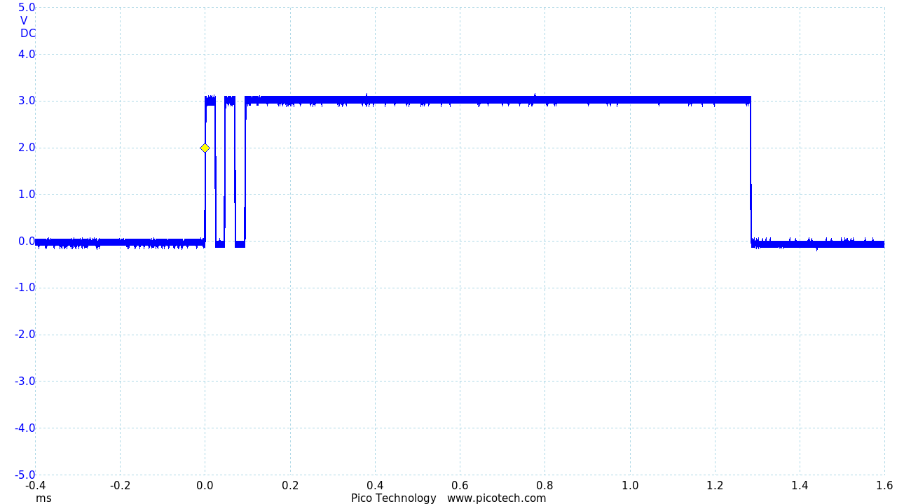

# FoRTE-Research - EmbeddedCrypto

This project measures the efficiency of different crypto algorithms installed in different microcontrollers. We identify the "best of breed" crypto for ultra-low SWaP devices in an energy harvesting context.
- Quantify the performance vs. energy trade space
- Identify device features that impact this trade space the most
- Assess the security impact when the attacker has access to intermediate results

## Board Support 

Candidate Boards  | ISA
------------- | -------------
MSP432P401R  | ARM
SiFive HiFive1 Rev B  | RISC-V 

## Cryptographic Algorithm

Algorithm  | key size
------------- | -------------
AES  | 128 bit / 192 bit / 256 bit
SHA  | 256 bit
ECC  | 

## Curve Support

SEC Group | Type | strength
------------- | ------------- | -------------
sect163k1  | GF(2^m) | 80 bit
sect163r2  | GF(2^m) | 80 bit
sect233k1  | GF(2^m) | 112 bit
sect233r1  | GF(2^m) | 112 bit
sect283k1  | GF(2^m) | 128 bit
sect283r1  | GF(2^m) | 128 bit
sect409k1  | GF(2^m) | 192 bit
sect409r1  | GF(2^m) | 192 bit
sect571k1  | GF(2^m) | 256 bit
sect571r1  | GF(2^m) | 256 bit
secp160r1  | GF(P) | 80 bit
secp192r1  | GF(P) | 96 bit
secp224r1  | GF(P) | 112 bit
secp256r1  | GF(P) | 128 bit
secp256k1  | GF(P) | 128 bit

## Getting Started

Download ARM GCC commandline tools: https://developer.arm.com/tools-and-software/open-source-software/developer-tools/gnu-toolchain/gnu-rm/downloads

Select the algorithm you want to use and copy all the file inside the folder to your root folder of board.

    .
    ├── ...
    ├── AES                    
    │   ├── all.c          
    │   ├── all.h         
    │   └── xxx.c                
    └── ...

**RISC-V :**
Change file name ".risc_Makefile" to "Makefile".\
**MSP432P401R :**
Uncomment the definition in the file containing the main function.

## Apollo3 Blue
Aside from the actual Sparkfun Edge development board (https://www.sparkfun.com/products/15170), you need a CH340C serial to USB adapter (https://www.sparkfun.com/products/15096).

#### Running AES
First, download the Ambiq Suite SDK for developing on Sparkfun Ambiq boards.
```
git clone --recursive https://github.com/sparkfun/AmbiqSuiteSDK
```

Next download and apply the serial adapter driver update.
```
git clone https://github.com/juliagoda/CH341SER.git
cd CH341SER
make
sudo make load
```

Next, navigate to the project directory for AES on the Apollo board:
```
cd aes/apollo/gcc
```

You are now ready to flash the AES program to the Apollo board.
Connect the serial-to-usb adapter to the PC and the Apollo board to the adapter.
Note that **you must run the make command as sudo** (because this command is going to flash the board) and **you must press down button 14 on the Edge board during programming** (to use the bootloader).
The format of the make command will vary depending on your installation. Generally:
```
sudo make BOARDPATH=<Ambiq SDK Location>/boards_sfe/edge COM_PORT=<The USB port the adapter is connected to> ASB_UPLOAD_BAUD=921600 SDKPATH=<Ambiq SDK Location> COMMONPATH=<Ambiq SDK Location>/boards_sfe/common bootload_asb
```
As an example, my complete make command is:
```
sudo make BOARDPATH=/home/harrison/AmbiqSuiteSDK/boards_sfe/edge COM_PORT=/dev/ttyUSB0 ASB_UPLOAD_BAUD=921600 SDKPATH=/home/harrison/AmbiqSuiteSDK COMMONPATH=/home/harrison/AmbiqSuiteSDK/boards_sfe/common bootload_asb
```

After programming, press the RST button on the Edge board. The green LED (labelled 44 on the silkscreen) should light up, indicating that the AES encryption succesfully completed.

#### Measuring execution time
The provided test code toggles GPIOs to be measured by an oscilloscope for timing the AES execution.

Probe pin 1 (labelled on the silkscreen) and reset the device to re-execute the AES encryption.
Before AES encryption, the pin is cleared.
Then, the pin is set immediately before the AES encryption and cleared immediately after.
Below is an example of the expected waveform for AES192.


TODO add timing using hardware timer
